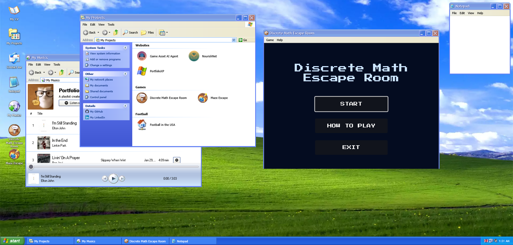

#  PortfolioXP

[](https://github.com/yonisabag11/portfolio)
[](https://github.com/yonisabag11/portfolio)
[](https://github.com/yonisabag11/portfolio/blob/main/LICENSE)

An interactive Windows XP-themed portfolio website showcasing my projects and skills in a nostalgic and engaging way.

## Live Website



[https://yonisabag11.github.io/portfolio](https://yonisabag11.github.io/portfolio)

## About This Project

This portfolio is an **adapted and enhanced version** of the original Windows XP portfolio created by [Paul Jaguin](https://github.com/UnMugViolet/portfolio). I've customized it to showcase my own projects and added several improvements.

### What I Changed

**Personalized Content** - Replaced all projects with my own work including:
  - Discrete Math Escape Room (Godot game)
  - Maze Escape (Unity game)
  - NourishNet (React Native mobile app)
  - Game Asset AI Agent (AI-powered web app)
  - PortfolioXP (this portfolio!)
  
**Bilingual Support** - Enhanced internationalization with English and Hebrew (RTL) support

**Updated Technologies** - Migrated from Vuex to Pinia for state management

**Added Tailwind CSS** - Integrated Tailwind CSS alongside SCSS for modern styling

**Deployment Setup** - Configured for GitHub Pages deployment with automated CI/CD

**Docker Support** - Added Docker containerization with nginx for easy deployment

**Content Updates** - Updated all legal notices, about sections, and contact information

**Project Documentation** - Added comprehensive project descriptions with objectives and technical details

### Credits

**Original Concept**: This project is based on the brilliant Windows XP portfolio by [Paul Jaguin (UnMugViolet)](https://github.com/UnMugViolet/portfolio). The original design, Windows XP interface recreation, and core functionality were created by him. I am grateful for his open-source contribution that made this adaptation possible.

**Windows XP Design**: All icons, wallpapers, sounds, and UI elements belong to Microsoft Corporation. This is a non-commercial educational project paying tribute to the classic Windows XP interface.

## Features

- Authentic Windows XP interface with pixel-perfect design
- Loading screen and login experience
- Bilingual support (English / Hebrew)
- Interactive games:
  - Maze Escape and Discrete Math Escape Room via embedded players
- Contact form powered by EmailJS
- Browse projects in Windows XP-style folders
- Notepad for viewing text documents
- Interactive CV/Resume viewer
- Image gallery with Windows Photo Viewer interface
- Calendar with event management (.ics file support)
- Music player with local playlist
- Global volume control
- Responsive design that adapts to different screen sizes

## Tech Stack

- **Framework**: Vue.js 3 with Composition API
- **Build Tool**: Vite
- **State Management**: Pinia
- **Routing**: Vue Router
- **Styling**: SCSS + Tailwind CSS
- **Internationalization**: Vue I18n
- **Email Service**: EmailJS
- **Deployment**: GitHub Pages
- **Containerization**: Docker + nginx

## Design Resources

The Windows XP interface was recreated using:
- [Dockurr Windows XP](https://github.com/dockur/windows) for reference
- Internet Archive for authentic Windows XP assets and resources
- Original Windows XP design by Microsoft Corporation

## Getting Started

### Prerequisites

- Node.js (v18 or higher recommended)
- npm or yarn

### Installation

```sh
npm install
```

### Development

Run the development server with hot-reload and SCSS compilation:

```sh
npm run dev:all
```

Or separately:

```sh
# Development server only
npm run dev

# SCSS compilation only
npm run sass
```

### Production Build

```sh
npm run build
```

The built files will be in the `dist` folder.

### Preview Production Build

```sh
npm run preview
```

## Docker Deployment

### Using Docker Compose

Create a `docker-compose.yml` file:

```yml
services:
  portfolio-xp:
    image: yonisabag11/portfolio-xp:latest
    container_name: portfolio_xp
    ports:
      - "35000:35000"
    volumes:
      - .:/app/data
    networks:
      - portfolio_network
    restart: unless-stopped

networks:
  portfolio_network:
    driver: bridge
```

Run the container:

```sh
docker compose up -d
```

Access the website at: [http://localhost:35000](http://localhost:35000)

### Building Your Own Image

```sh
docker build -t my-portfolio-xp .
```

## Project Structure

```
portfolio/
├── public/              # Static assets (images, sounds, fonts)
├── src/
│   ├── components/      # Vue components
│   ├── views/          # Page views
│   ├── layouts/        # Layout components
│   ├── stores/         # Pinia stores
│   ├── router/         # Vue Router config
│   ├── data/           # JSON data files
│   ├── locales/        # i18n translation files
│   └── main.js         # App entry point
├── sass/               # SCSS stylesheets
├── css/                # Compiled CSS
├── Dockerfile          # Docker configuration
├── nginx.conf          # Nginx configuration
└── vite.config.js      # Vite configuration
```

## License

This project is licensed under the MIT License. See the [LICENSE](LICENSE) file for details.

## Contributing

This is a personal portfolio project, but feel free to fork it and create your own version. If you find bugs or have suggestions, please open an issue.

## Contact

Yoni Sabag
- Email: yonisabag11@gmail.com
- Portfolio: [https://yonisabag11.github.io/portfolio](https://yonisabag11.github.io/portfolio)
- GitHub: [@yonisabag11](https://github.com/yonisabag11)

## Acknowledgments

- **Original Creator**: [Paul Jaguin (UnMugViolet)](https://github.com/UnMugViolet/portfolio) for the Windows XP portfolio concept
- **Microsoft**: For the Windows XP design
- **Dockurr**: For the Windows XP Docker image
- **Open Source Community**: For the libraries and tools used in this project
